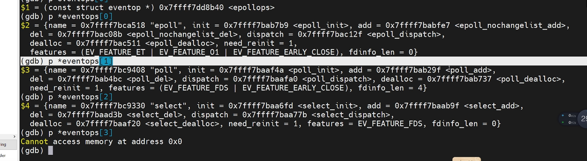
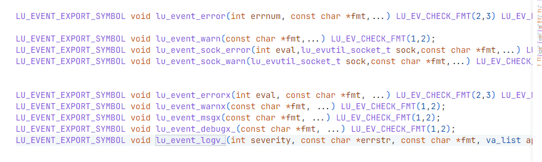

# Development log

# Monday 9 Dec 2024
 - [x] 封装lu_mm-internal.h 头文件
 - [x] LU_EVENT__DISABLE_CUSTOM_MM_REPLACEMENT 宏 

默认启用自定义内存管理，如果需要禁用，则定义 'LU_EVENT__DISABLE_CUSTOM_MM_REPLACEMENT' 宏。
    
~~~c
#define mm_malloc(size) 			    lu_event_mm_malloc_(size)
#define mm_calloc(nitems, size) 	    lu_event_mm_calloc_((nitems), (size))
#define mm_strdup(str) 			        lu_event_mm_strdup_(str)
#define mm_realloc(ptr, size) 		    lu_event_mm_realloc_((ptr), (size))
#define mm_free(ptr) 				    lu_event_mm_free_(ptr)
~~~

# Tuesday 10 Dec 2024

 - [x] 完成了mm-internal.h头文件的封装，实现了mm_malloc、mm_calloc、mm_strdup、mm_realloc、mm_free等函数。
 - [x] 完成了lu_memory_以及条件日志输出(默认输出到memory_management.log文件)
QUESTION: 
    - [ ] sizeof(*ptr) 无法准确反映动态分配的内存大小，可以考虑在内存分配时额外存储内存块大小，或者使用自定义的内存管理来追踪内存块大小。

# Wednesday 11 Dec 2024
完善lu_error.h lu_error.c 提供宏

使用数组实现以及hash表实现的字符串映射，采用惰性加载的方式，减少内存占用。

~~~c
 // 自定义错误码，从0x100开始
#define LU_ERROR_OPERATION_NOT_PERMITTED 0x100
#define LU_ERROR_NO_SUCH_FILE_OR_DIRECTORY 0x101
#define LU_ERROR_NO_SUCH_PROCESS 0x102
#define LU_ERROR_INTERRUPTED_SYSTEM_CALL 0x103
#define LU_ERROR_INPUT_OUTPUT_ERROR 0x104
#define LU_ERROR_NO_SUCH_DEVICE_OR_ADDRESS 0x105
#define LU_ERROR_ARGUMENT_LIST_TOO_LONG 0x106
#define LU_ERROR_EXEC_FORMAT_ERROR 0x107
#define LU_ERROR_BAD_FILE_DESCRIPTOR 0x108
#define LU_ERROR_NO_CHILD_PROCESSES 0x109
#define LU_ERROR_TRY_AGAIN 0x10A
#define LU_ERROR_OUT_OF_MEMORY 0x10B
#define LU_ERROR_PERMISSION_DENIED 0x10C
#define LU_ERROR_BAD_ADDRESS 0x10D
#define LU_ERROR_BLOCK_DEVICE_REQUIRED 0x10E
#define LU_ERROR_DEVICE_OR_RESOURCE_BUSY 0x10F
#define LU_ERROR_FILE_EXISTS 0x110
#define LU_ERROR_CROSS_DEVICE_LINK 0x111
#define LU_ERROR_NO_SUCH_DEVICE 0x112
#define LU_ERROR_NOT_A_DIRECTORY 0x113
#define LU_ERROR_IS_A_DIRECTORY 0x114
#define LU_ERROR_INVALID_ARGUMENT 0x115
#define LU_ERROR_FILE_TABLE_OVERFLOW 0x116
#define LU_ERROR_TOO_MANY_OPEN_FILES 0x117
#define LU_ERROR_NOT_A_TYPEWRITER 0x118
#define LU_ERROR_TEXT_FILE_BUSY 0x119
#define LU_ERROR_FILE_TOO_LARGE 0x11A
#define LU_ERROR_NO_SPACE_LEFT_ON_DEVICE 0x11B
#define LU_ERROR_ILLEGAL_SEEK 0x11C
#define LU_ERROR_READ_ONLY_FILE_SYSTEM 0x11D
#define LU_ERROR_TOO_MANY_LINKS 0x11E
#define LU_ERROR_BROKEN_PIPE 0x11F
#define LU_ERROR_MATH_ARGUMENT_OUT_OF_DOMAIN_OF_FUNCTION 0x120
#define LU_ERROR_RESULT_TOO_REPRESENTABLE 0x121
#define LU_MAX_ERROR_CODE 0x122  // 假设错误码的最大值
~~~
对外提供的接口：
~~~c
const char* lu_get_error_string(int errno);
const char* lu_get_error_string_hash(int errno);
~~~

# Friday 13 Dec 2024

默认启用log
~~~ c
#if !defined(LU_EVENT__DISABLE_DEBUG_MODE) || defined(LU_USE_DEBUG)
#define LU_EVENT_DEBUG_LOGGING_ENABLED
#endif

#ifdef LU_EVENT_DEBUG_LOGGING_ENABLED
LU_EVENT_EXPORT_SYMBOL extern lu_uint32_t lu_event_debug_logging_mask_;
#define lu_event_debug_get_logging_mask_() (lu_event_debug_logging_mask_)
#else
#define lu_event_debug_get_logging_mask_() (0)
#endif
~~~
提供宏LU_EVENT__DISABLE_DEBUG_MODE 用于关闭调试日志输出。 LU_USE_DEBUG  用于控制是否编译调试日志输出代码。

~~~c
#define LU_EVENT_LOG_DEBUG  0
#define LU_EVENT_LOG_MSG    1
#define LU_EVENT_LOG_WARN   2
#define LU_EVENT_LOG_ERROR  3
~~~

~~~c
static lu_event_log_cb 		lu_event_log_global_fn_ = NULL;
static lu_event_fatal_cb 	lu_event_fatal_global_fn_ = NULL;
~~~
提供lu_event_log_global_cb      回调函数，用于自定义输出日志。
提供lu_event_fatal_global_fn_,  用于自定义输出致命错误日志。

使用 inline 和符号导出结合可能导致编译器不能正确生成符号。
在lu_util.h 中封装lu_evutil_vsnprintf lu_evutil_snprintf 函数来兼容不同平台。

逐步完善lu_log.c lu_log-internal.h 提供日志输出接口。lu_event_enable_debug_logging(which_mask) 用于打开调试日志输出。

# Saturday 14 Dec 2024

完善lu_log.c lu_log-internal.h 

 - [X] 逐步完善一下以下宏以及实现
~~~c
#define LU_EVENT_EXPORT_SYMBOL
LU_EVENT_EXPORT_SYMBOL void lu_event_error(int errnum, const char *fmt,...) LU_EV_CHECK_FMT(2,3) LU_EV_NORETURN;

LU_EVENT_EXPORT_SYMBOL void lu_event_warn(const char *fmt,...) LU_EV_CHECK_FMT(1,2);
LU_EVENT_EXPORT_SYMBOL void lu_event_sock_error(int eval,lu_evutil_socket_t sock,const char *fmt,...) LU_EV_CHECK_FMT(3,4) LU_EV_NORETURN;
LU_EVENT_EXPORT_SYMBOL void lu_event_sock_warn(lu_evutil_socket_t sock,const char *fmt,...) LU_EV_CHECK_FMT(2,3);
LU_EVENT_EXPORT_SYMBOL void lu_event_errorx(int eval, const char *fmt, ...) LU_EV_CHECK_FMT(2,3) LU_EV_NORETURN;
LU_EVENT_EXPORT_SYMBOL void lu_event_warnx(const char *fmt, ...) LU_EV_CHECK_FMT(1,2);
LU_EVENT_EXPORT_SYMBOL void lu_event_msgx(const char *fmt, ...) LU_EV_CHECK_FMT(1,2);
LU_EVENT_EXPORT_SYMBOL void lu_event_debugx_(const char *fmt, ...) LU_EV_CHECK_FMT(1,2);
LU_EVENT_EXPORT_SYMBOL void lu_event_logv_(int severity, const char *errstr, const char *fmt, va_list ap) LU_EV_CHECK_FMT(3,0);
~~~

添加
~~~c
static void (*lu_mm_aligned_malloc_log_fn_)(const char* operationvoid* ptr, size_t size) = NULL;

#define mm_memalign(size, alignment)    lu_event_mm_aligned_malloc_((size), (alignment))

lu_event_debug_get_logging_mask_ //全局debug_mask 根据此mask 来判断是否进行日志输出

~~~

 - [x] 完善了lu_evutil_socket_geterror 获取socket错误描述字符串。
 - [x] lu_evutil_socket_error_to_string 转换socket错误码到错误描述字符串。
 - [x] lu_evutil_socket_error_to_string 内部采用了hash表实现字符串映射。

调用了uthash 库实现hash表。
临时存储结构为
~~~c
//缓存存储
typedef struct lu_cached_sock_errs_entry_s {
    int code;
    char *msg;
    UT_hash_handle hh;  // 用于 uthash 哈希表的处理
}lu_cached_sock_errs_entry_t;
~~~

# Sunday 15 Dec 2024

准备开始编写luevent内部的hash表实现，参考uthash 库。
参考实现
[6.1   哈希表 - Hello 算法](https://www.hello-algo.com/chapter_hashing/hash_map/)

[Implementation of Hash Table in C/C++ using Separate Chaining - GeeksforGeeks](https://www.geeksforgeeks.org/implementation-of-hash-table-in-c-using-separate-chaining/#)
//参考实现
[uthash - a lightweight hash table implementation for C](https://troydhanson.github.io/uthash/)

封装了lu_hash_table.c lu_has_table-internal.h 提供以下hash接口

~~~c
int lu_hash_function(int key, int table_size);
lu_hash_table_t* lu_hash_table_init(int table_size);
void lu_hash_table_insert(lu_hash_table_t* table, int key, void* value);
void* lu_hash_table_find(lu_hash_table_t* table, int key);
void lu_hash_table_delete(lu_hash_table_t* table, int key);
void lu_hash_table_destroy(lu_hash_table_t* table);
~~~

 git config --global credential.helper cache

# Monday 16 Dec 2024
 
 - [x] 进一步修复hash表内部的红黑树实现 
 - [x] 完善lu_hash_table.c lu_has_table-internal.h  
 - [x] 修复了lu_hash_table 内存泄漏问题 在`lu_hash_table_insert`函数中

 ## 错误记录
问题如下：
1. 链表指针清理问题： 在转换桶内链表到红黑树时，先设置了

~~~c
bucket->data.list_head = NULL; // 清空链表头指针
~~~

2. 然后继续执行链表遍历代码：

~~~c
node = bucket->data.list_head;
while (node != NULL) {
    lu_hash_bucket_node_ptr_t temp = node;
    node = node->next;  // 此处 node->next 导致错误
    free(temp);
}
~~~

这里 bucket->data.list_head 已被设置为 NULL，导致 node 也被初始化为 NULL。此时遍历链表时 node->next 会导致 Segmentation Fault。

解决方案如下：
~~~c
// 插入链表中的所有元素到红黑树
node = bucket->data.list_head;
while (node != NULL) {                                              
    lu_rb_tree_insert(new_tree, node->key, node->value);
    node = node->next;
}

// 清理链表内存
node = bucket->data.list_head;
while (node != NULL) {
    lu_hash_bucket_node_ptr_t temp = node;
    node = node->next;
    free(temp);
}
bucket->data.list_head = NULL; // 最后清空链表头指针，防止悬挂指针

// 将桶的类型修改为红黑树，并关联新创建的红黑树
bucket->type = LU_BUCKET_RBTREE;
bucket->data.rb_tree = new_tree;
~~~

# Tuesday 17 Dec 2024

基本完成了luevent内部的hash表实现，并测试通过。
测试了插入 查找 操作；以及内部链表与红黑树的转换.

 - [x] 以及hash内部链表与红黑树的转换调控算法，以便于扩展。
 - [x] 以及hash function 算法，以便于扩展。

优化了hash function :（乘法哈希 + 位运算优化）

# Wednesday 18 Dec 2024

Habby Birthday !!!!

 继续完成 17 Dec 2024 未完成的工作，包括：

 - [x] 编写测试用例
 - [X] 测试删除、添加等操作
 - [x] 完善文档

# Thursday 19 Dec 2024

- [x] 完善lu_rb_tree的封装

- [x] 修复lu_hash_insert 函数，需要判断重复是否来更新数据，而不是直接插入。

# Friday 20 Dec 2024
  
  从lu_hash_table 更新hash_table的代码
 - [X] 完善lu_rb_tree的封装
 - [X] 完善lu_utils vnsprintf 以及socket error的内部实现

# Saturday 21 Dec 2024

- [x] 完善lu_hash_table的代码,对其单独封装成库

# Sunday 22 Dec 2024
- [x] 完成了lu_hash_table 的insert 封装
- [x] lu_hash_table_t 内部添加了element_count 计数器，用于统计元素个数
- [x] lu_hash_bucket_t 内部添加了esize_bucket 计数器，用于统计bucket内的元素个数

# Saturday  28 Dec 2024

- [X] 开源了lu_hash_table 库
- [X] 完善了log.c 日志输出接口
