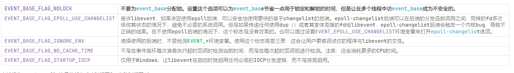

# lu_event_base_config_flag_u

EVENT_BASE_FLAG_STARTUP_IOCP : Windows only.

EVENT_BASE_FLAG_EPOLL_USE_CHANGELIST:
告诉libevent，如果决定使用epoll后端，可以安全地使用更快的基于changelist的后端。epoll-changelist后端可以在后端的分发函数调用之间，同样的fd多次修改其状态的情况下，避免不必要的系统调用。但是如果传递任何使用dup（）或者其变体克隆的fd给libevent，epoll-changelist后端会触发一个内核bug，导致不正确的结果。在不使用epoll后端的情况下，这个标志是没有效果的。也可以通过设置EVENT_EPOLL_USE_CHANGELIST环境变量来打开epoll-changelist选项。